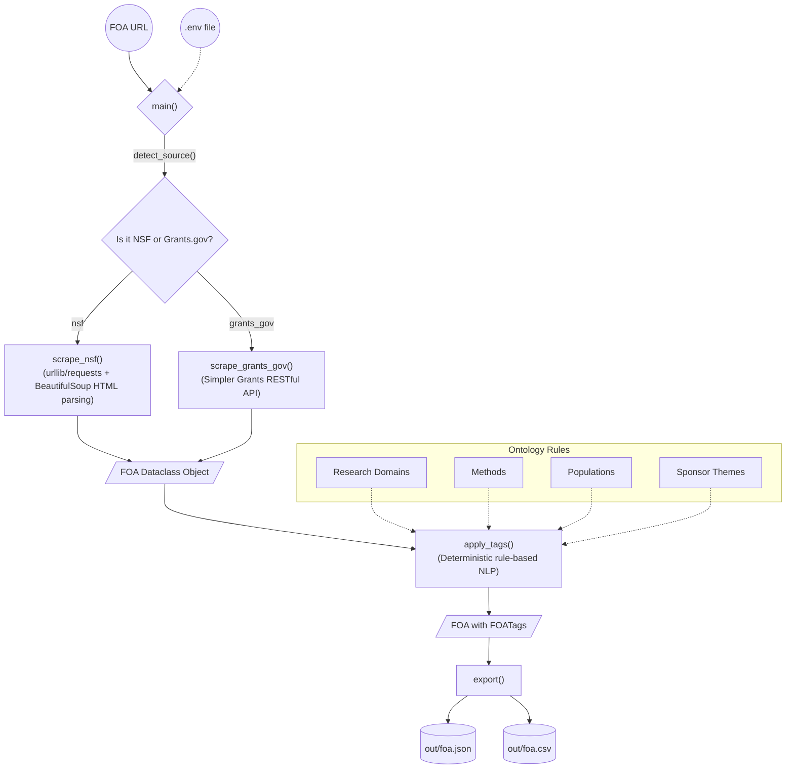

# FOA Ingestion Pipeline (GSoC 2026 Screening Task)

## Architecture



Hey there! This is my submission for the HumanAI Foundation (ISSR) screening task. It's a Python script that takes a URL for a Funding Opportunity Announcement (FOA), scrapes the key details out of it, figures out the relevant semantic tags, and exports everything cleanly to JSON and CSV formats.

I built this to support both **NSF** (via standard HTML scraping since their pages are pretty straightforward) and **Grants.gov** (via the Simpler Grants REST API, since Grants.gov is fully client-side rendered and trickier to scrape cleanly).

## How to run it

First, grab the dependencies (I recommend using a venv):

```bash
python3 -m venv venv
source venv/bin/activate
pip install -r requirements.txt
```

### Scraping an NSF URL (No API key needed)

NSF is the easiest to test since we don't need any auth:

```bash
python main.py --url "https://www.nsf.gov/funding/opportunities/pesose-pathways-enable-secure-open-source-ecosystems/nsf26-506/solicitation" --out_dir ./out
```

### Scraping a Grants.gov URL

If we want to test the Grants.gov side, we'll need a free API key from [simpler.grants.gov/api-dashboard](https://simpler.grants.gov/api-dashboard). Once we have that, we can either pass it as a flag or drop it in a `.env` file as `GRANTS_GOV_API_KEY`.

```bash
export GRANTS_GOV_API_KEY="your-key-here"
python main.py --url "https://simpler.grants.gov/opportunity/721d5c2c-af72-4c33-8ce6-013b1e8ad59b" --out_dir ./out
```

## How the tagging works

Rather than using heavy ML models for this screening task, I implemented a deterministic, rule-based tagger. It checks the title, description, and eligibility text against a curated dictionary of keywords spanning:
- Research domains (like AI, healthcare, energy)
- Methods (like machine learning, clinical trials)
- Target populations (like students, rural communities)
- Sponsor themes

## What's in the box

I consolidated everything into a single file to make it easier to review:
- `main.py`: Contains the dataclass schema, the NSF HTML scraper, the Grants.gov API client, the tagging logic, and the export functions.
- `requirements.txt`: Just the basics (`requests`, `beautifulsoup4`, `python-dateutil`, `python-dotenv`).
- `MyCV.pdf`: My resume.
- `out/`: Contains the generated outputs for both ingestion methods:
  - `foa_nsf.json` & `foa_nsf.csv` (NSF test extraction)
  - `foa_grantgov.json` & `foa_grantgov.csv` (Grants.gov test extraction)

## Future Ideas

If we take this further for the actual GSoC project, I think the next steps would be:
1. Swapping the rule-based tagger for an embedding-based approach (like `sentence-transformers`).
2. Adding a vector store (Chroma or FAISS) to allow similarity searches across FOAs.
3. Adding support for NIH RePORTER or DOE EERE.

Thanks for reviewing!

— Amruth (GSoC 2026 Applicant)
